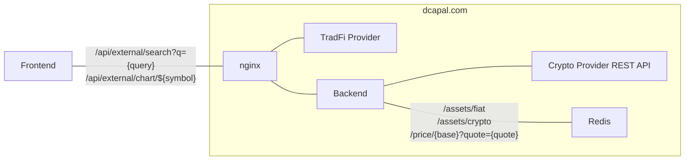

<p align="center">
  <a href="https://dcapal.com"></a>
</p>

<p align="center">
<a href="https://dcapal.com"></a>
<a href="https://github.com/leonardoarcari/dcapal/actions/workflows/build-test.yml"></a>
<a href="https://github.com/leonardoarcari/dcapal/blob/master/LICENSE"></a>
</p>

## About

[DcaPal](https://dcapal.com) is a pragmatic **Dollar Cost Averaging tool** for passive investors like me: financially-educated people managing their own portfolios of not-too-many assets replicating major world indices.

I was facing a common problem: it's that time of the month, got some savings to invest and have to split them across my portfolio assets. *How the heck can I do it so that my portfolio stays balanced?*

Hence DcaPal. You come here every week/month/quarter, build your portfolio, define asset allocation in percentage, input how much you want to invest and **let the algorithm do the splitting for you**.

## Getting started

You can start using [DcaPal](https://dcapal.com) right away. It's free. No registration required.

**Build** your own portfolio or, if you don't know where to start, explore our **Demo** portfolios:

- [60/40 Portfolio](https://dcapal.com/demo/60-40)
- [All-seasons Portfolio](https://dcapal.com/demo/all-seasons)

## Build Instructions

DcaPal does not store any user data. But if you are still concerned for your privacy, you can build and run it on your machine.

**Start Docker environment**

```bash
cd dcapal-backend
docker compose -f docker-compose.yml -f docker/docker-compose.dev.yml up -d
```

**Run DcaPal backend**

Prepare `dcapal.yml` config file

```bash
cd dcapal-backend
cp config/dcapal/dcapal.yml dcapal.yml
```

Compile and start backend service

```bash
cargo run --release
```

**Run DcaPal frontend**

Build DcaPal Optimizer

```bash
cd dcapal-optimizer-wasm
curl https://rustwasm.github.io/wasm-pack/installer/init.sh -sSf | sh
wasm-pack build --release
```

Install NPM dependencies. Note: this is installing `dcapal-optimizer-wasm` package as well.

```bash
cd ../dcapal-frontend
npm install # Install dcapal-optimizer-wasm pkg as well
```

Run frontend server

```bash
npm run start
```
## Architecture


