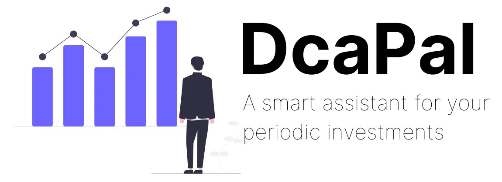
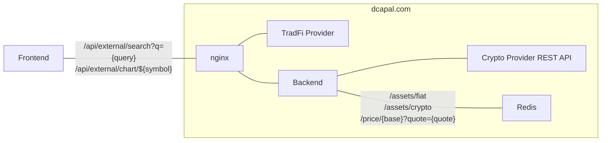

<p align="center">
  <a href="https://dcapal.com"></a>
</p>

<p align="center">
<a href="https://dcapal.com"></a>
<a href="https://github.com/dcapal/dcapal/actions/workflows/build-test.yml"></a>
<a href="https://github.com/dcapal/dcapal/blob/master/LICENSE"></a>
</p>

## About

[DcaPal](https://dcapal.com) is a pragmatic **Dollar Cost Averaging tool** for passive investors like me:
financially-educated people managing their own portfolios of not-too-many assets replicating major world indices.

I was facing a common problem: it's that time of the month, got some savings to invest and have to split them across my
portfolio assets. *How the heck can I do it so that my portfolio stays balanced?*

Hence DcaPal. You come here every week/month/quarter, build your portfolio, define asset allocation in percentage, input
how much you want to invest and **let the algorithm do the splitting for you**.

## Demo

https://github.com/user-attachments/assets/ba80874e-5b78-440d-a055-7db8fbfe7084

## Getting started

You can start using [DcaPal](https://dcapal.com) right away. It's free. No registration required.

**Build** your own portfolio or, if you don't know where to start, explore our **Demo** portfolios:

- [60/40 Portfolio](https://dcapal.com/demo/60-40)
- [All-seasons Portfolio](https://dcapal.com/demo/all-seasons)
- [21Shares Crypto Basket 10 (HODLX)](https://dcapal.com/demo/hodlx)

## Build Instructions

DcaPal does not store any user data. But if you are still concerned for your privacy, you can build and run it on your
machine.

**Start the local application environment**

`make local-up` starts the local Supabase Auth stack, renders the ignored
backend configuration with its JWT signing keys, and starts the TimescaleDB,
Redis, and DcaPal containers. Supabase's PostgreSQL instance is not used for
DcaPal migrations or application data.

```bash
make local-up
```

(Note: if you're using a Mac with an ARM processor, you should replace (in the docker-compose dev file) Cadvisor's image
version with gcr.io/cadvisor/cadvisor:v0.47.1 and set platform: linux/aarch64)

**Run DcaPal frontend**

Build DcaPal Optimizer

```bash
cd dcapal-optimizer-wasm/crates/optimizer
curl https://rustwasm.github.io/wasm-pack/installer/init.sh -sSf | sh
wasm-pack build --release --out-dir ../../pkg
```

Install JavaScript dependencies from the repository root. The optimizer build must happen first because the frontend uses its generated package as a local dependency.

```bash
cd ../../..
pnpm install --frozen-lockfile
```

Run frontend server

```bash
pnpm frontend:dev
```

## Architecture


```mermaid
flowchart LR
    Frontend[Frontend] ---|"/api/external/search?q={query}<br>/api/external/chart/${symbol}"|nginx[nginx]
    subgraph dcapal.com
        nginx---TradFiProvider[TradFi Provider]
        nginx---Backend[Backend]
        Backend---CryptoProvider[Crypto Provider REST API]
        Backend---|"/assets/fiat<br>/assets/crypto<br>/price/{base}?quote={quote}"|Redis[Redis]
    end
```

## Contributing

Contributions and suggestions about how to improve this project are welcome! Please follow
our [contribution guidelines](CONTRIBUTING.md).

## Thanks to all Contributors ❤️

Born as a personal Sunday morning project, DcaPal would have never grown so much without the help of heros willing to
contribute with their time and work. Thank you very much ya all!

<a href="https://github.com/dcapal/dcapal/graphs/contributors">
  
</a>
