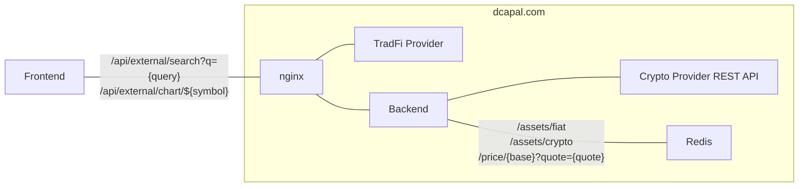

<p align="center">
  <a href="https://dcapal.com"></a>
</p>

<p align="center">
<a href="https://dcapal.com"></a>
<a href="https://github.com/dcapal/dcapal/actions/workflows/build-test.yml"></a>
<a href="https://github.com/dcapal/dcapal/blob/master/LICENSE"></a>
</p>

## About

[DcaPal](https://dcapal.com) is a pragmatic **Dollar Cost Averaging tool** for passive investors like me:
financially-educated people managing their own portfolios of not-too-many assets replicating major world indices.

I was facing a common problem: it's that time of the month, got some savings to invest and have to split them across my
portfolio assets. *How the heck can I do it so that my portfolio stays balanced?*

Hence DcaPal. You come here every week/month/quarter, build your portfolio, define asset allocation in percentage, input
how much you want to invest and **let the algorithm do the splitting for you**.

## Demo

https://github.com/user-attachments/assets/ba80874e-5b78-440d-a055-7db8fbfe7084

## Getting started

You can start using [DcaPal](https://dcapal.com) right away. It's free. No registration required.

**Build** your own portfolio or, if you don't know where to start, explore our **Demo** portfolios:

- [60/40 Portfolio](https://dcapal.com/demo/60-40)
- [All-seasons Portfolio](https://dcapal.com/demo/all-seasons)
- [21Shares Crypto Basket 10 (HODLX)](https://dcapal.com/demo/hodlx)

## Build Instructions

DcaPal does not store any user data. But if you are still concerned for your privacy, you can build and run it on your
machine.

**Run the local application environment**

The first run bootstraps the pinned Supabase and WASM tools, installs the
workspace dependencies, creates ignored local configuration, starts Supabase,
Redis, and TimescaleDB, and applies migrations. Later runs reuse the generated
package, dependencies, database volume, and build caches.

Choose the backend process that matches your work:

```bash
# Fast path: run Rust on the host
make local-up

# Host backend plus frontend at http://localhost:3000
make local-up-ui

# Build dcapal-backend:local and run it in Compose
make local-docker-up

# Docker backend plus frontend at http://localhost:3000
make local-docker-up-ui
```

No configuration from another checkout is required. The helper creates
`dcapal-backend/docker/local.env` from the committed example and renders the
backend configuration for either host or container networking.

Stop or reset the local environment with:

```bash
make local-down              # host backend mode
make local-docker-down       # Docker backend mode
make local-reset             # remove this worktree's local volumes and containers
make local-doctor             # check prerequisites
```

Observability is optional and Grafana uses port 3001:

```bash
make local-observability-up
make local-observability-down
```

The application database is separate from Supabase's PostgreSQL instance.
Supabase provides local authentication and its signing keys; DcaPal data and
migrations use the TimescaleDB Compose service.

## Architecture


```mermaid
flowchart LR
    Frontend[Frontend] ---|"/api/external/search?q={query}<br>/api/external/chart/${symbol}"|nginx[nginx]
    subgraph dcapal.com
        nginx---TradFiProvider[TradFi Provider]
        nginx---Backend[Backend]
        Backend---CryptoProvider[Crypto Provider REST API]
        Backend---|"/assets/fiat<br>/assets/crypto<br>/price/{base}?quote={quote}"|Redis[Redis]
    end
```

## Contributing

Contributions and suggestions about how to improve this project are welcome! Please follow
our [contribution guidelines](CONTRIBUTING.md).

## Thanks to all Contributors ❤️

Born as a personal Sunday morning project, DcaPal would have never grown so much without the help of heros willing to
contribute with their time and work. Thank you very much ya all!

<a href="https://github.com/dcapal/dcapal/graphs/contributors">
  
</a>
